# iHome
iHome - приложение для управления умным домом. С помощью этого приложения вы сможете управлять 
smart-устройствами удаленно как в ручном режиме, так и создавая события по расписанию и 
изменению температуры окружающей среды.

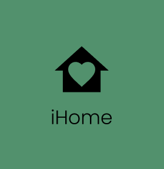

Для работы в данном приложении вам необходимо зарегистрироваться и зайти в личный кабинет.
После необходимо подключиться к домашней сети wi-fi.

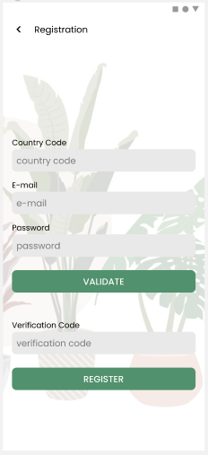
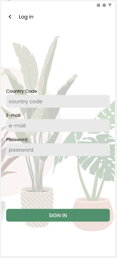
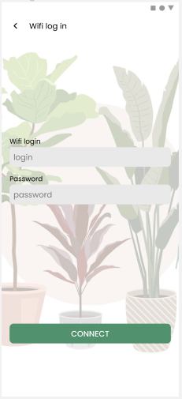

iHome имеет три основные вкладки: Home, Control, Account.

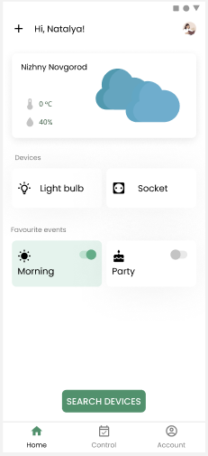
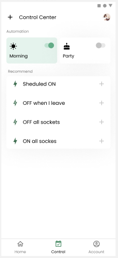
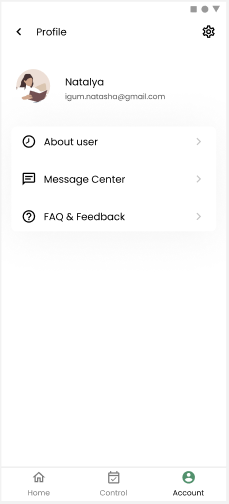

Вы сможете выбрать тип вашего устройства.

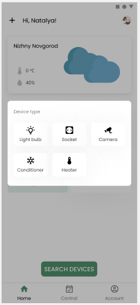

Создать задачи на включение/выключение устройства по расписанию и по изменению температуры.

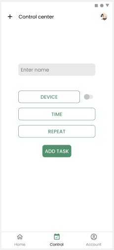
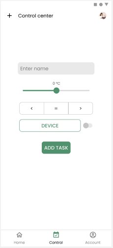

Также есть возможность управления устройствами в ручном режиме.

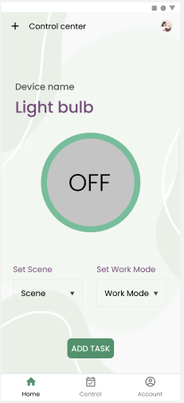
